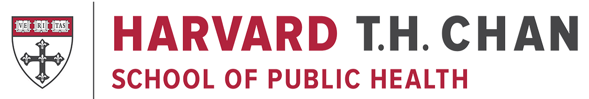
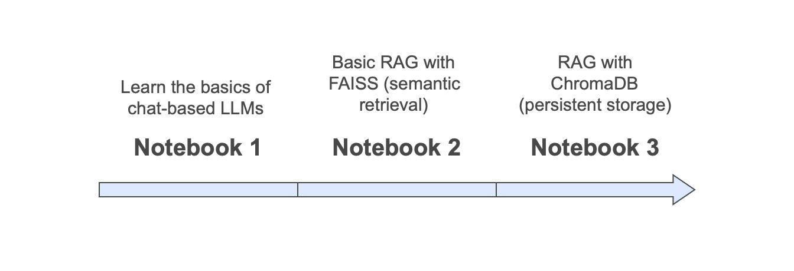

<br>

# EPI 264 - Advanced Epidemiology of Aging 
## Lab2 - RAG and Prompt Engineering to Extract Real-World Phenotypes

---
## Overview

This repository contains the materials for:

- **Lab 2 (Session 8):** RAG and Prompt Engineering to Extract Real-World Phenotypes

In this lab, students build on Lab 1 and use cleaned clinical notes to explore **LLM- and RAG-based phenotype extraction** for dementia and cognitive concerns.

The goal is not simply to run a large language model, but to understand how prompts, retrieval, and note context influence what the model can extract from clinical text.

---
## Before You Begin

Before starting Lab 2, make sure you have:

- completed **Lab 1**
- a working Python environment
- **Ollama** installed and running locally
- the **Qwen2** model pulled locally
- the required output files from Lab 1:
  - `lab1_clean_notes_baseline.parquet`
  - `lab1_structured_dementia_eval.csv`

If you have not completed these steps, refer to the **Lab 2 handout** provided in the course materials.

---

## Quick Setup

### 1. Clone the Repository

```bash

git clone https://github.com/v-mourajr/hsph_epi264_lab2_rag.git
cd hsph_epi264_lab2_rag

````

### 2. Create and Activate a Virtual Environment

```bash

#Create the Environment on MacOS/Linux or Windows:
python3 -m venv epi264_lab2

# Activate On MacOS/Linux:
source epi264_lab2/bin/activate  

# Activate On Windows: 
.\epi264_lab2\Scripts\activate
```

### 3. Install Python Dependencies

```bash
pip install --upgrade pip
pip install -r requirements.txt
```

### 4. Install and Verify Ollama

* Visit [https://ollama.com/download](https://ollama.com/download)
* Choose your operating system and follow the installation steps
* After installation, open a terminal and verify:

```bash
ollama -v
```

### 5. Pull the Qwen2 Model

Run this command to download the model locally:

```bash
# Download the model:
 pull qwen2

# You can check available local models by running:
ollama list

# Run qwen2 in a terminal:
ollama run qwen2
```

> You can find a list of all available Ollama models at [https://ollama.com/library](https://ollama.com/library)
---
## Recommended Development Environment: Visual Studio Code

We recommend using [Visual Studio Code (VS Code)](https://code.visualstudio.com/) with the following extensions:

  * **Python** (by Microsoft)
  * **Jupyter** (by Microsoft)

These enable full support for notebooks inside VS Code.

---

## Running the Notebooks in VS Code

1. Open the cloned repository folder in VS Code
2. Open any notebook file
3. In the top right corner, select the Python kernel for your Lab 2 environment (`epi264_lab2`)
4. Run cells using Shift + Enter or Run All
If the kernel does not appear, install and register it:
```bash
pip install ipykernel
python -m ipykernel install --user --name epi264_lab2
```

## Notebooks Overview

### 1. `Lab2_1_Prompt_Basics.ipynb`

- Introduces prompt engineering fundamentals using a local LLM
- Shows how system messages, user messages, and prompt templates work
- Applies prompting to dementia phenotype extraction from cleaned clinical notes

### 2. `Lab2_2_rag_foundation.ipynb`

- Introduces the basic RAG workflow
- Uses embeddings and FAISS to retrieve clinically relevant notes
- Passes retrieved note context to an LLM for dementia phenotype extraction

### 3. `Lab2_3_rag_chromadb.ipynb`

- Extends the same workflow using ChromaDB as a persistent vector store
- Demonstrates how note embeddings can be stored and retrieved across sessions
- Shows a more durable version of the same LLM- and RAG-based phenotype extraction workflow




## License

Developed by Valdery Moura Junior, PhD, MBA  
Harvard T.H. Chan School of Public Health  

These materials are intended for educational use only.